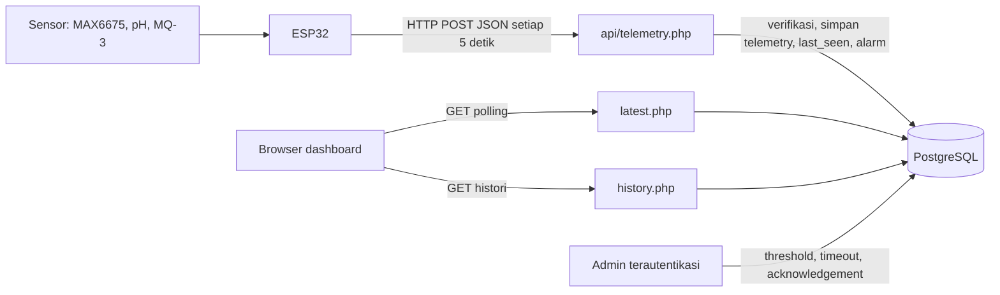

# Classic Enzyme IoT

Sistem pemantauan fermentasi berbasis ESP32 untuk bioreaktor *Classic Enzyme*. Perangkat membaca sensor proses, mengirim telemetri melalui HTTP JSON, lalu aplikasi PHP menyimpan data, mengevaluasi ambang batas, dan menyajikannya melalui dashboard web realtime.

Proyek ini sengaja tidak memakai MQTT, Node.js, Composer, atau proses background. Arsitektur tersebut membuatnya mudah dijalankan pada PHP hosting biasa, cPanel, VPS, maupun laptop pengembangan. *Realtime* dicapai melalui polling browser, bukan WebSocket.

> Status implementasi saat ini: firmware mengaktifkan MAX6675 saja secara bawaan. Pembacaan pH dan MQ-3 sudah didukung oleh kode serta skema database, tetapi dinonaktifkan sampai sensor dan kalibrasinya siap.

## Arsitektur dan aliran data



Siklus satu kiriman telemetri:

1. ESP32 membaca sensor yang aktif dan RSSI Wi-Fi.
2. ESP32 mengirim JSON ke `api/telemetry.php`, membawa `device_id` dan API key.
3. Endpoint menolak device tidak terdaftar atau API key yang tidak cocok, lalu menyimpan satu baris histori jika valid.
4. Endpoint memperbarui `devices.last_seen`, menandai status tersimpan `online`, lalu membandingkan nilai terhadap threshold per device. Pelanggaran membuat baris baru di `alarms`.
5. Dashboard mengambil pembacaan terakhir setiap 3 detik; grafik/tabel histori dimuat ulang setiap 6 detik. Status online yang ditampilkan dihitung dari selisih `last_seen`, sehingga tidak bergantung pada kolom status yang tersimpan.

## Kemampuan yang tersedia

- Dashboard publik untuk suhu, pH, alkohol, RSSI, status koneksi, grafik Chart.js, dan log terakhir. Kartu realtime mengosongkan nilai jika tidak ada telemetri valid dalam 15 detik; data lama tetap tersedia di halaman riwayat.
- Pemilih device; API dan dashboard mendukung banyak device yang terdaftar.
- Riwayat dengan rentang `1h`, `6h`, `24h`, `7d`, atau semua data, statistik min/max/rata-rata, serta ekspor CSV hingga 5.000 baris per device.
- Alarm suhu rendah/tinggi, pH rendah/tinggi, dan alkohol tinggi. Alarm tidak dideduplikasi: setiap pembacaan di luar ambang dapat membuat alarm baru sampai di-*acknowledge*.
- Panel admin berbasis sesi: ubah threshold, timeout offline, *acknowledge* alarm, lihat API key/IP pengirim terakhir, dan ganti password.
- Tema terang/gelap disimpan pada `localStorage`; antarmuka memakai CSS/JS native dan gaya Liquid Glass.

## Struktur proyek

```text
IOT/
├── index.php                         # Dashboard realtime publik
├── history.php                       # Riwayat, statistik, dan ekspor CSV publik
├── login.php / logout.php             # Autentikasi admin berbasis session
├── admin.php                          # Threshold, timeout, alarm, device, akun
├── api/
│   ├── telemetry.php                  # POST ingest dan evaluasi alarm
│   ├── latest.php                     # GET pembacaan/device terkini
│   ├── history.php                    # GET data grafik dan statistik
│   └── devices.php                    # GET daftar device serta status hitung
├── config/
│   ├── database.php                   # PDO PostgreSQL, schema, indeks, settings
│   └── auth.php                       # Session dan proteksi admin
├── firmware/esp32_classic_enzyme/
│   └── esp32_classic_enzyme.ino       # Firmware ESP32
├── components/                        # Partial UI dashboard
├── assets/css/style.css               # Desain responsif Liquid Glass
├── assets/js/app.js                   # Polling, Chart.js, tema, simulasi
└── .htaccess                          # Proteksi Apache untuk config/db dan header dasar
```

## Penyimpanan data

`config/database.php` hanya menggunakan PostgreSQL. Schema dan indeks dapat dibuat sekali saat bootstrap dengan `DB_AUTO_INIT_SCHEMA=true`; setelah produksi stabil, ubah ke `false` agar request web tidak menjalankan DDL berulang. Koneksi PostgreSQL gagal akan menghasilkan error, bukan fallback ke database lain.

| Tabel | Isi |
|---|---|
| `devices` | identitas device, nama/lokasi, API key, dan `last_seen` |
| `telemetry` | setiap pembacaan sensor, RSSI, firmware, IP, waktu device/server |
| `thresholds` | batas min/max per parameter dan per `device_id` |
| `alarms` | pelanggaran threshold dan status acknowledgement |
| `admins` | username dan hash password |
| `settings` | konfigurasi global, saat ini `offline_timeout_seconds` |

Schema PostgreSQL dan seed diinisialisasi oleh fungsi dalam `config/database.php`. Default seed adalah device `esp32-ce-001` dengan placeholder API key yang **wajib diganti sebelum dipakai**, threshold suhu `20–40 °C`, pH `3.0–4.5`, alkohol maksimum `800` ADC, dan timeout offline `300` detik.

## Prasyarat

- PHP 8.x dengan ekstensi `pdo_pgsql`.
- PostgreSQL 14+ dan user database yang memiliki schema `public`.
- Browser dengan JavaScript aktif dan akses internet ke CDN Chart.js (`cdn.jsdelivr.net`) untuk grafik.
- Arduino IDE dengan board ESP32 serta library bawaan `WiFi`, `HTTPClient`, dan `WiFiClientSecure` untuk firmware.

## Menjalankan lokal

Gunakan PostgreSQL lokal atau container PostgreSQL. Contoh setelah database dan user dibuat:

```bash
cd "/Users/favian/Proyek /Classic Enzyme/IOT"
DB_HOST=127.0.0.1 DB_PORT=5432 DB_NAME=classic_enzyme_iot \
DB_USER=classic_enzyme DB_PASS='PASSWORD_DATABASE' \
DB_AUTO_INIT_SCHEMA=true php -S 127.0.0.1:8899
```

Buka <http://127.0.0.1:8899>. Schema PostgreSQL dibuat otomatis saat bootstrap pertama. Untuk mencoba ingest tanpa hardware, gunakan API key device yang sudah diprovision atau:

```bash
NOW=$(date +%s)
curl -X POST http://127.0.0.1:8899/api/telemetry.php \
  -H 'Content-Type: application/json' \
  -H 'X-API-Key: API_KEY_DEVICE_ANDA' \
  -d "{\"device_id\":\"esp32-ce-001\",\"temperature\":35.40,\"ph\":3.82,\"alcohol\":125,\"rssi\":-62,\"firmware\":\"2.0.0\",\"protocol_version\":2,\"ts\":${NOW},\"boot_id\":\"0123456789abcdef0123456789abcdef\",\"sequence\":1}"
```

`api/telemetry.php` hanya menerima API key melalui header `X-API-Key`; key tidak boleh dimasukkan ke JSON body.

## Konfigurasi dan deploy

Gunakan environment variables, bukan mengedit kredensial ke dalam kode:

```bash
DB_HOST=127.0.0.1
DB_PORT=5432
DB_NAME=classic_enzyme_iot
DB_USER=nama_user
DB_PASS=password_rahasia
DB_AUTO_INIT_SCHEMA=false
```

Untuk produksi, buat database PostgreSQL kosong, bootstrap dengan `DB_AUTO_INIT_SCHEMA=true`, uji seluruh endpoint, lalu ubah ke `false`. Jangan mengaktifkan fallback database.

Letakkan isi folder `IOT` sebagai document root/subdomain. Konfigurasi `.htaccess` memblokir akses browser ke `config/`, `db/`, dan sejumlah ekstensi sensitif pada Apache. Pada Nginx, aturan setara harus dibuat di konfigurasi server; `.htaccess` tidak dibaca Nginx.

## Firmware ESP32

Salin `firmware/esp32_classic_enzyme/secrets.example.h` menjadi `secrets.h`, lalu isi konfigurasi lokal sebelum firmware di-flash. File `secrets.h` diabaikan Git dan ESP32 tetap konek/reconnect Wi-Fi otomatis saat boot:

```cpp
constexpr char WIFI_SSID[] = "NAMA_WIFI";
constexpr char WIFI_PASSWORD[] = "PASSWORD_WIFI";
constexpr char SERVER_URL[] = "https://IP_PUBLIK_VPS_ANDA/api/telemetry.php";
constexpr char DEVICE_ID[] = "esp32-ce-001";
constexpr char API_KEY[] = "API_KEY_UNIK_DEVICE";
```

| Sensor | Pin ESP32 | Catatan |
|---|---:|---|
| MAX6675 / termokopel K | SCK 18, SO 19, CS 5 | suhu, diaktifkan bawaan |
| MQ-3 analog | GPIO 34 | alkohol; input-only |
| pH analog | GPIO 35 | pH; input-only |
| LED bawaan | GPIO 2 | menyala ketika proses kirim |

Aktifkan sensor hanya setelah terpasang dengan mengubah `SENSOR_*_TERPASANG` menjadi `true`. Sensor nonaktif atau pembacaan MAX6675 invalid dikirim sebagai `null`, dan `null` tidak memicu alarm parameter tersebut. Pembacaan pH memakai kalibrasi linear (`PH_7_VOLTAGE` dan `PH_SLOPE`) yang harus dikalibrasi terhadap probe Anda; nilai MQ-3 saat ini adalah ADC rata-rata 10 sampel, bukan konsentrasi alkohol terkalibrasi/ppm.

Firmware mengirim setiap 5.000 ms dan mencoba menyambung ulang Wi-Fi sebelum pengiriman. Sebelum telemetri dikirim, firmware menyinkronkan waktu NTP, memverifikasi sertifikat HTTPS dengan `TLS_ROOT_CA`, lalu mengirim timestamp Unix serta `boot_id`/`sequence` untuk anti-replay. Untuk VPS tanpa domain, gunakan URL `https://IP_PUBLIK_VPS/...`, buat sertifikat server dengan IP VPS pada Subject Alternative Name (SAN), lalu isi `TLS_ROOT_CA` dengan CA yang menandatanganinya. Firmware menolak URL non-HTTPS dan menunda kirim bila waktu belum valid. Belum ada antrean flash atau retry persisten ketika internet putus.

Payload yang didukung:

```json
{
  "device_id": "esp32-ce-001",
  "temperature": 34.75,
  "ph": null,
  "alcohol": null,
  "raw_temp": 34.75,
  "raw_adc": null,
  "rssi": -64,
  "firmware": "2.0.0",
  "protocol_version": 2,
  "ts": 1760000000,
  "boot_id": "0123456789abcdef0123456789abcdef",
  "sequence": 42
}
```

Endpoint mengizinkan `POST` dan preflight `OPTIONS`; respons sukses berisi `status`, `telemetry_id`, `server_time`, dan `alarms_count`.

## Kontrak API ringkas

| Endpoint | Akses | Fungsi |
|---|---|---|
| `POST /api/telemetry.php` | device + API key | ingest satu pembacaan |
| `GET /api/latest.php?device_id=…` | publik | nilai terakhir, threshold, status online, jumlah alarm aktif |
| `GET /api/history.php?device_id=…&range=1h&limit=60&order=asc` | publik | histori (limit 10–10.000) dan statistik |
| `GET /api/devices.php` | publik | daftar device serta pembacaan terakhir |

Rentang API history: `1h`, `6h`, `24h`, `7d`, atau `all`; `order` hanya `asc` atau `desc`. `latest.php` menyembunyikan `ip_address` kecuali sesi admin aktif. Halaman `history.php?action=export_csv` juga hanya menambahkan kolom IP kepada admin.

## Admin dan keamanan operasional

Masuk melalui `/login.php` dengan seed awal `admin` / `password`, lalu segera ganti password. Menu admin mendukung perubahan timeout offline (minimal 30 detik), threshold, dan acknowledgement alarm. Implementasi antarmuka threshold saat ini dipatok ke `esp32-ce-001`, meskipun skema dan endpoint mendukung threshold per device; untuk device tambahan, masukkan record `devices` dan `thresholds` melalui database sampai UI multi-device admin ditambahkan.

Sebelum produksi:

- Ganti API key placeholder dan password admin. API key hanya dikirim pada header `X-API-Key`, disimpan sebagai hash setelah autentikasi pertama, dan tidak ditampilkan ulang di panel admin.
- Gunakan HTTPS dengan CA penerbit sertifikat yang benar pada `TLS_ROOT_CA`; firmware tidak lagi menerima URL HTTP atau memakai `setInsecure()`.
- Batasi asal akses endpoint/API dengan firewall atau jaringan privat bila memungkinkan. Endpoint API memakai `Access-Control-Allow-Origin: *` dan belum menerapkan rate limiting.
- Pastikan `.htaccess` aktif atau buat aturan Nginx ekuivalen, dan jangan simpan kredensial di web root tanpa proteksi.
- Cadangkan tabel `telemetry`; tidak ada retensi, agregasi, maupun pembersihan otomatis.

## Batasan yang perlu dipahami

- Alarm dicatat pada setiap sampel out-of-range dan tidak otomatis kembali normal/tertutup.
- Status offline adalah hasil hitung dari `last_seen` dan `offline_timeout_seconds`; sistem tidak membuat alarm khusus ketika device kemudian menjadi offline.
- Dashboard publik dan endpoint GET tidak memerlukan login. API key melindungi ingest, bukan pembacaan data.
- Kode firmware memakai `WiFiClientSecure` bahkan jika `SERVER_URL` masih `http://`; gunakan URL HTTPS dalam deployment atau sesuaikan klien HTTP secara eksplisit.
- Migrasi dari MySQL lama harus dilakukan sebagai proses ETL/pgloader terpisah; runtime aplikasi ini tidak menyediakan fallback atau koneksi MySQL.
